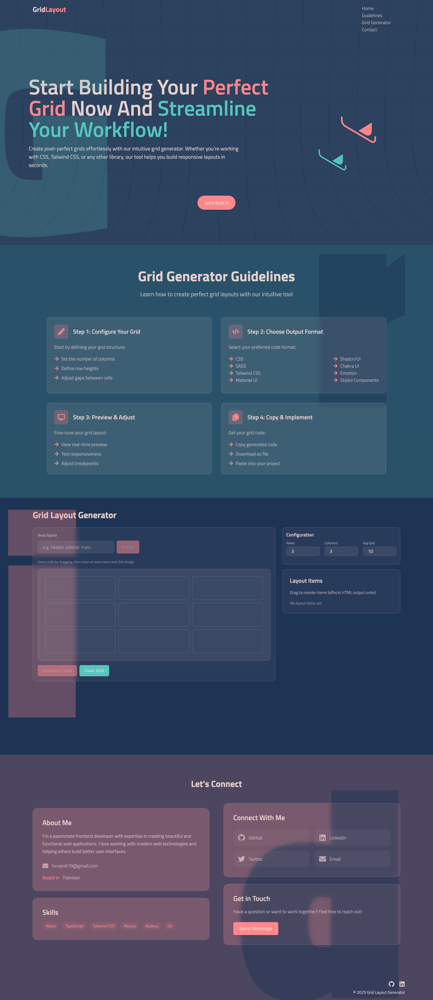

# Grid Layout Generator

A modern, elegant web application for generating responsive grid layouts with multiple framework support. Built with React, TypeScript, and Tailwind CSS.



## Features

- 🎨 **Visual Grid Builder**

  - Intuitive drag-and-select interface
  - Real-time grid preview
  - Customizable rows, columns, and gaps
  - Responsive design

- 🛠️ **Multiple Framework Support**

  - CSS
  - SASS
  - Tailwind CSS
  - Material UI
  - shadcn/ui
  - Chakra UI
  - Emotion
  - Styled Components

- ⚙️ **Code Generation Options**

  - CSS Variables support
  - CSS Modules support
  - TypeScript support
  - Framework-specific optimizations

- 🎯 **User Experience**
  - Glassmorphism design
  - Smooth animations
  - Responsive layout
  - Dark mode support
  - Copy-to-clipboard functionality

## Getting Started

### Prerequisites

- Node.js (v14 or higher)
- npm or yarn or pnpm (recommended)

### Installation

1. Clone the repository:

```bash
git clone https://github.com/hxnain619/grid-layout-generator.git
cd grid-layout-generator
```

2. Install dependencies:

```bash
pnpm i
# or
yarn install
```

3. Start the development server:

```bash
pnpm dev
# or
yarn dev
```

4. Open [http://localhost:5173](http://localhost:5173) in your browser.

## Usage

1. **Configure Grid**

   - Set the number of rows and columns
   - Adjust the gap between grid items
   - Use the visual grid builder to select areas

2. **Assign Areas**

   - Enter area names (e.g., "header", "sidebar", "main")
   - Click "Assign" to apply the area to selected cells
   - Repeat for all desired areas

3. **Generate Code**
   - Click "Generate Code"
   - Select your preferred framework
   - Choose additional options (CSS Variables, CSS Modules, TypeScript)
   - Copy the generated code

## Project Structure

```
src/
├── components/
│   ├── common/          # Reusable UI components
│   ├── GridLayoutCanvas/ # Main grid builder component
│   └── animations/      # Animation components
├── pages/
│   ├── section/        # Page sections
│   └── Home.tsx        # Main page component
├── hooks/              # Custom React hooks
├── lib/               # Utility functions
├── types/             # TypeScript type definitions
└── utils/             # Helper functions
```

## Technologies Used

- React
- TypeScript
- Tailwind CSS
- Vite
- class-variance-authority
- clsx
- React Icons

## Contributing

Contributions are welcome! Please feel free to submit a Pull Request.

1. Fork the repository
2. Create your feature branch (`git checkout -b feature/AmazingFeature`)
3. Commit your changes (`git commit -m 'Add some AmazingFeature'`)
4. Push to the branch (`git push origin feature/AmazingFeature`)
5. Open a Pull Request

## License

This project is licensed under the MIT License - see the [LICENSE](LICENSE) file for details.

## Author

- **Hasnain** - [GitHub](https://github.com/hxnain619) - [LinkedIn](https://linkedin.com/in/hxnain619)

## Acknowledgments

- Inspired by modern grid layout tools and frameworks
- Built with modern web technologies and best practices
- Special thanks to all contributors and users
